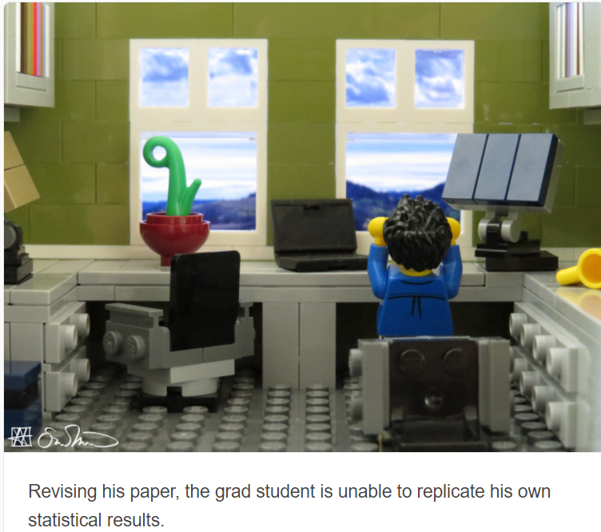
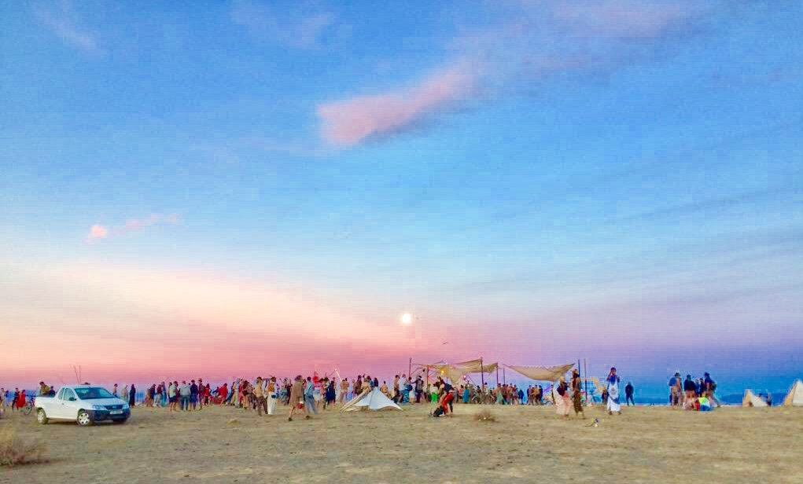

```{r setup, include=FALSE}
knitr::opts_chunk$set(echo = FALSE)
```

### about me.
I am a second year PhD student in the Health Systems program in the department
of International Health and I hold an MPH from Columbia University. My background 
is in humanitarian health and my research interests are the same.  I hope
to focus my dissertation research on mortality measurement in emergency settings.

### background.
Before coming to JHU, I worked in a range of positions in field epidemiology and 
M&E in humanitarian settings. Most recently, I have been working as a field epidemiologist with Doctor's Without Borders (MSF) responding to a range of emergencies including: conflict-related trauma in Syria, the Ebola response in 
DRC, and the Tigray crisis in Ethiopia.  

### coding.
I use R for most of my data analysis and have spent many a late night wrangling
data. I have a love-hate relationship with it, being mostly self-taught.  I'm 
hoping to save myself some future blood, sweat, and tears by learning from the 
best in this course.

For reference, this has been me more times than I can say..........




Revising his paper, the grad student is unable to replicate his own results 
Source: [Lego Grad Student](https://brickademics.com/)

The [R4epi handbook](https://www.r4epi.com/) has been a life saver during many 
of those times!


### five fun facts.
1. I am an amateur fan of adventure sports.  Prior to COVID-19, I began 
sky-diving and kite-surfing.  I've run several marathons, have my deep-water 
scuba certification, and love to snowboard and surf.
2. I have traveled to 53 countries as per my last count.
3. I met Harry Potter in real life and he could not have been nicer.
4. I love music and music festivals and have been to Afrikaburn 3 times (pictured below).
5. I started getting tattoos late in life and am totally addicted.

--------------------------------------------------------------------------------




